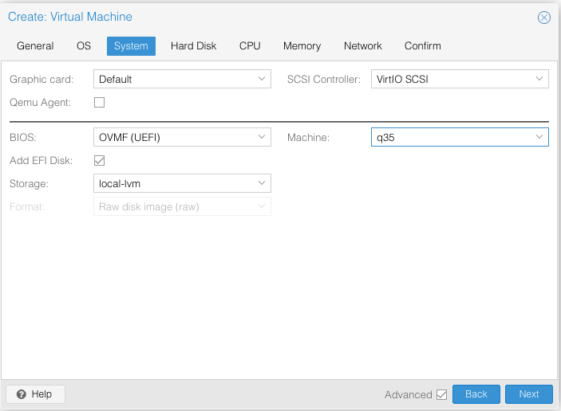
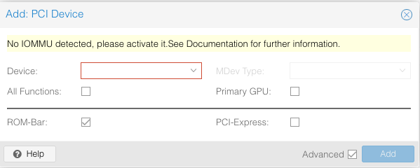

# Configuring PCIe Passthrough for Nested Virtualization on Proxmox

### Summary:

If you are running bare-metal L0 (level 0) Proxmox ([PVE](https://pve.proxmox.com/wiki/Main_Page)) hypervisor with nested PVE hypervisor in L1 VM, and you wish to passthrough a PCIe device, physically attached to the bare-metal machine, to a VM inside the L1 VM (nested PVE), then this may be for you.

This was tested on a machine using Intel Xeon X5670, which has the required Virtualization Technology for Directed I/O (VT-d) support with Proxmox PVE v7.0-2. 

### Challenges:

I have a PCIe-to-SATA expansion card added to my computer and a SATA DVD drive was connected to it. Ultimately, I wanted the L2 VM to be able to fully control the drive.

Most PCIe passthrough guides found all over the Internet do not cover how one can set up passthrough for L2 VM residing in L1 [nested hypervisor](https://pve.proxmox.com/wiki/Nested_Virtualization) on top of L0 bare-metal hypervisor due to nested VM being two levels deep, which is needless for most people due to potential performance issues and no live migration support.

If you are like me, who prefers to experiment with passthrough on VMs directly on L1 PVEs due to clustering, then you have come to the right place.

Unfortunately, even [Proxmox's PCIe passthrough guide](https://pve.proxmox.com/wiki/PCI(e)_Passthrough) doesn't cover nested virtualization. The minimal OS configuration needed for PCIe passthrough for supported Intel machine is updating the kernel command-line parameter, `intel_iommu=on`, which will be covered in later steps.

### Requirements:

This guide assumes some familiarity with Proxmox (e.g. creating VMs). 

There are two sets of requirements we need to fulfill as one is intended for *nested virtualization* and the other is for *PCIe passthrough*.

The below requirements are intended for the L1 PVE VM. Not the L2 VM guest.

##### Nested Virtualization:

 - CPU on bare-metal machine requires hardware-assisted virtualization extensions (e.g. Intel VT-x, AMD-V) which needs to be enabled in BIOS/UEFI.
 - Nested PVE (L1) using the same PVE version as the bare-metal PVE (L0)
 - Nested PVE VM needs to have CPU set to `host` type (ex. `qm set <vmid> --cpu host`)
 - Nested PVE VM needs to use `ovmf` BIOS implementation (ex. `qm set <vmid> --bios ovmf`)
 - Nested PVE VM requires `q35` QEMU machine type (ex. `qm set <vmid> --machine q35`)

**NOTE**: It's extremely important to use `q35` QEMU machine type and `ovmf` BIOS implementation together before booting up the machine. Otherwise, a kernel panic may occur, even at the bare-metal level and a hard reboot may be required to unseize the machine.

Nested virtualization may already be enabled for you if you are running the latest version of PVE. PVE 7.0 seems to have it enabled by default. To check, run `cat /sys/module/kvm_intel/parameters/nested` on L0 and you'd get either `Y` or `N`.

You can also configure the options through the web GUI instead of `qm` command. It's recommended to add only EFI disk on a storage location with no extra options but not required.



##### PCIe Passthrough:

 - Bare-metal requires CPU and motherboard with IOMMU (I/O Memory Management Unit) interrupt remapping support (e.g. Intel VT-d, AMD-Vi). Many modern CPUs and motherboards support this. This needs to be enabled in BIOS/UEFI settings.
 - For nested PVE, CPU also needs to be `host` type, `ovmf` BIOS implementation is required, and `q35` QEMU machine type is necessary. This requirement is already outlined in the [Nested Virtualization](#nested-virtualization) section.

### Configuring Passthrough:

##### Enable IOMMU for L0:

Before we can proceed, we'd need to make sure the L0 hypervisor (bare-metal PVE) has IOMMU enabled, which can be done by tuning the kernel command-line parameter.

As mentioned in Proxmox [documentation](https://pve.proxmox.com/wiki/PCI(e)_Passthrough), you need to add `intel_iommu=on` in the bootloader configuration file depending on which one one you are using. Usually BIOS are found on legacy systems whereas UEFI are on modern systems. GRUB bootloader is typically for BIOS system, and EFI bootloader is for UEFI. Please see [Proxmox documentation](https://pve.proxmox.com/wiki/Host_Bootloader#sysboot_edit_kernel_cmdline) on editing the kernel command-line.

A reboot would be required after updating the kernel parameter in bootloader configuration file.

To verify, run `dmesg | grep -e DMAR -e IOMMU -e AMD-Vi` and if you see lines containing `IOMMU`, `Directed I/O`, or `Interrupt Remapping` being enabled, then you are set.

##### Enable IOMMU for L1 PVE:

This assumes L1 PVE has been created and you are ready to create a VM from L1 PVE virtual machine.

Before we can get to the next step, you also need to modify the kernel parameter for the L1 PVE the same way you did for L0 PVE in the previous section.

##### Create L2 VM:

You should already have the ability to add PCI device to the L1 VM through the *Hardware* settings.

At this point, you should be able to passthrough a PCIe device from L0 to L1 PVE. It would be listed in `lspci -nnk` output in L1 PVE's shell.

Proceed to create the L2 VM using any compatible Linux guest OS of your choice (Windows hasn't been tested) with the following virtual hardware requirements.

- `OVMF` BIOS implementation must be used
- `q35` machine type is required

Go ahead attempt to add the passthrough PCI device as well.

What did you get? A warning like the one below?



Despite updating the kernel parameter, you are faced with this error until you add a vIOMMU device to the L1 PVE, which was missing all along.

##### Where is the vIOMMU option?

You may wonder where you may have missed this option while creating the PVE. It turns out, it's not natively included with Proxmox tools at the time of this writing as [VT-d emulation](https://wiki.qemu.org/Features/VT-d) would need to be added in QEMU.

How VM is run on PVE is through the `/usr/bin/qemu-system-x86_64` command. You would see that `/usr/bin/kvm` is a symbolic link to the previous command that powers the VMs on PVE.

Run the `qm showcmd <vmid>` command for any configured VM of your choice, and you would see a very long `kvm` command. The long command derives from the configurations that you'd make to the VM.

To view the VM configuration via command, run `qm config <vmid>`, which is human-readable as all options are in alphabetical order. Please see more information on `qm` command [here](https://pve.proxmox.com/pve-docs/qm.1.html).

According to the [QEMU wiki article](https://wiki.qemu.org/Features/VT-d#With_Assigned_Devices) previously mentioned, the options needed to add the vIOMMU device to L1 PVE can theoretically be done through the `qm set <vmid> --args` command.


```
qm set 100 --args '-device intel-iommu,intremap=on,caching-mode=on -machine accel=kvm,kernel-irqchip=split'
```

The above change would also reflect in the `qm config` and `qm showcmd` commands.

However... Because `qm set <vmid> --args` would simply append the missing options to the end of the long `kvm` command, it would not work. The QEMU article said the `intel-iommu` device must be specificed before all other device parameters that you'd see in the `kvm` command.

You would have to shutdown the PVE, modifying the `kvm` command and add the missing options. The major drawback is that this change would have to be made each time you boot if you need IOMMU support for passthrough.

##### Adding vIOMMU to L1 PVE:

Fortunately, I've created a [Python script](./add_vIOMMU.py) to simplify the job. Hopefully, one day the Proxmox team can embed the vIOMMU option in a future release.

Just simply go to the L0 PVE's shell and run the commands below using the L1 PVE's VM ID. The script will not send a reboot signal and it'd passively wait for the VM to shutdown (not reboot as the script would be booting back up the VM).

```
wget https://raw.githubusercontent.com/bashtheshell/IOMMU-nested-pve/main/add_vIOMMU.py
python3 add_vIOMMU.py <vmid>
```

Please note that the above script may not be compatible with older version of PVE as this was tested on 7.0. At least Python 3.5 would be required.

Also, the script would have to be run at each boot when IOMMU is needed.

##### Re-attempt to add passthrough PCI device to L2 VM:

Previously, you may have received an error message on L2 VM that IOMMU isn't detected. Now that should no longer be the case.

Upon booting up the L2 VM, you should be able to see it in `lspci -nnk` output inside the guest OS. If yes, YOU ARE ALL SET! 

If you are still facing challenges, then chances are you may be required to do further tweaking. Please review Proxmox's PCIe passthrough documentations.


### Special Thanks:

Thanks to thenickdude for his [contribution](https://www.reddit.com/r/Proxmox/comments/qsc5z4/nested_virtualization_passthrough_vm_in_l1_pve/) to my Reddit post, which steered me to the solution.

And of course, the Proxmox and QEMU/KVM teams for making all things possible for us homelabbers and tinkers.
